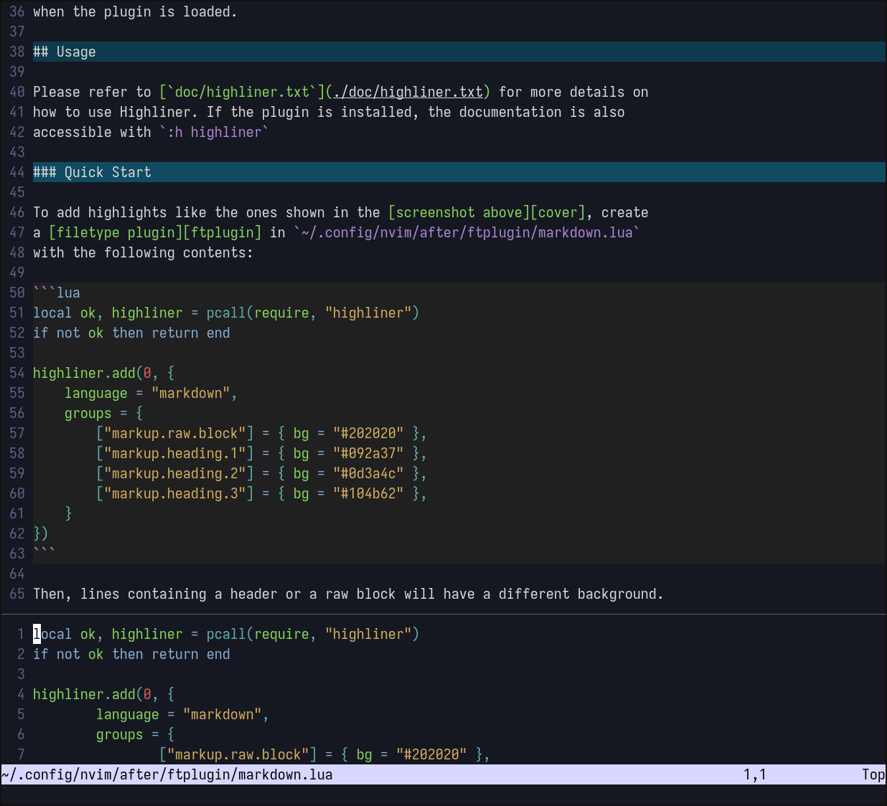
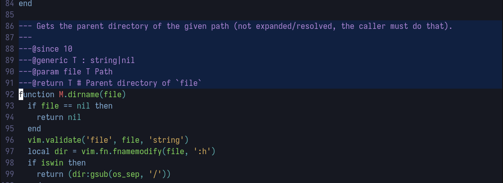

<h1 align="center">Highliner</h1>

<div align="center">

**[Installation](#installation) | [Usage](#usage)**

</div>

Highliner is a Neovim plugin to add highlights to lines containing
[Tree-sitter queries][tsq]. The differece with the functionality provided by
Neovim is that these highlights are applied to the entire line (instead of only
to characters), so it can be used to set a background color that covers the full
window width.

[tsq]: https://neovim.io/doc/user/treesitter/#_treesitter-queries
[tshl]: https://neovim.io/doc/user/treesitter/#treesitter-highlight

---



---

## Installation

Highliner can be installed with any package manager for Neovim, like
[`vim.pack`](https://neovim.io/doc/user/pack/#_plugin-manager):

```lua
vim.pack.add { "https://github.com/ayosec/nvim-highliner" }
```

The `setup()` function receives no options, and it is executed automatically
when the plugin is loaded.

## Usage

Please refer to [`doc/highliner.txt`](./doc/highliner.txt) for more details on
how to use Highliner. If the plugin is installed, the documentation is also
accessible with `:h highliner`

### Quick Start

To add highlights like the ones shown in the [screenshot above][cover], create
a [filetype plugin][ftplugin] in `~/.config/nvim/after/ftplugin/markdown.lua`
with the following contents:

```lua
local ok, highliner = pcall(require, "highliner")
if not ok then return end

highliner.add(0, {
    language = "markdown",
    groups = {
        ["markup.raw.block"] = { bg = "#202020" },
        ["markup.heading.1"] = { bg = "#092a37" },
        ["markup.heading.2"] = { bg = "#0d3a4c" },
        ["markup.heading.3"] = { bg = "#104b62" },
    }
})
```

Then, lines containing a header or a raw block will have a different background.

Instead of using [filetype plugins][ftplugin], patterns can also be added with
a [`FileType` autocommand][aufiletype]. For example, by adding this snippet to
the Neovim configuration:

```lua
local ok, highliner = pcall(require, "highliner")
if ok then
    vim.api.nvim_create_autocmd("FileType", {
        group = vim.api.nvim_create_augroup("highliner.custom.filetypes", {}),
        callback = function()
            highliner.add(0, {
                language = { "lua", "rust" },
                groups = {
                    ["comment.documentation"] = { bg = "#102040" },
                }
            })
        end,
    })
end
```

Luadoc comments can look like this:



### User Commands

Highlights can be enabled or disabled with `:HighlinerToggle`.

After making changes in the configuration, use `:HighlinerClear` and then
`:filetype detect` to reload those changes.

[aufiletype]: https://neovim.io/doc/user/autocmd/#FileType
[cover]: ./.github/README/cover.webp
[ftplugin]: https://neovim.io/doc/user/filetype/#filetype-plugins
